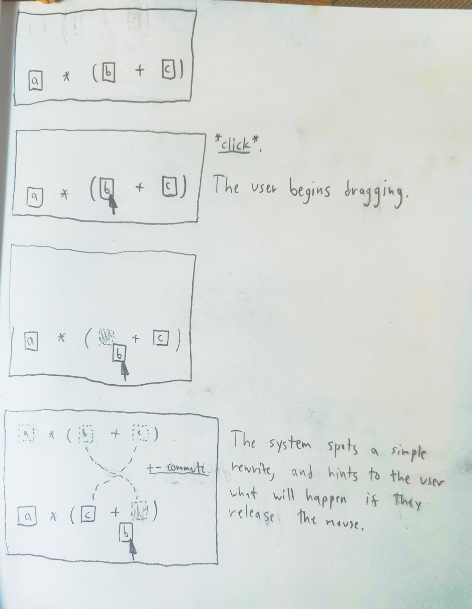
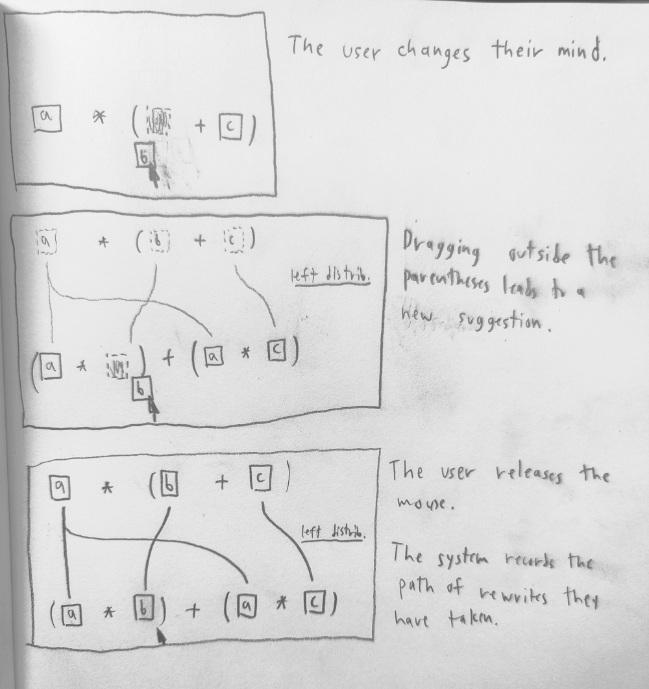
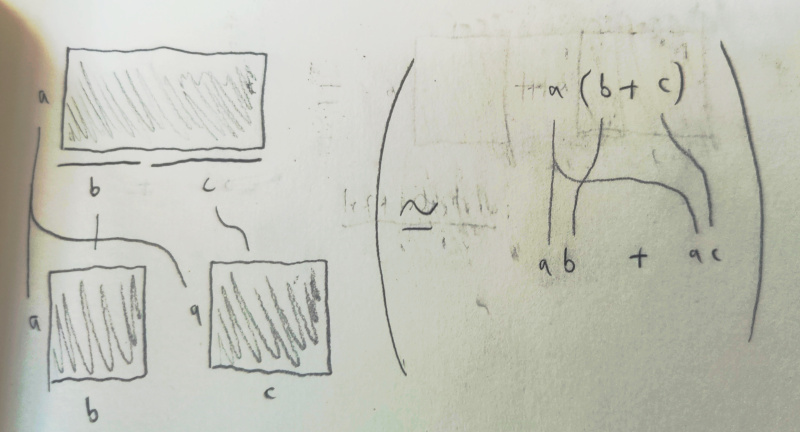

# Concrete user interfaces for abstract algebra

## Problem

A "proof" is an argument considered convincing by some community of practice, like plumbers or mathematicians. A "formal system" is a rulebook declaring precisely which proofs are considered convincing. "Algebra" is hard to define, but you know it when you see it.

Mathematical formal systems have exploded in breadth and scope over the past century. Interest in "mathematical foundations" -- a ruleset for all of mathematics -- has remained keen since the notion was first conceived, despite its being proven impossible. In the past few decades, uptake of computer-checked formal proof assistants has grown, with substantial bodies of work being formalized. Much of this work has an algebraic and constructive flavor -- it mainly involves concrete manipulations of tree-like data structures.

The public has no idea that any of this is going on. In fact they have little understanding of what mathematicians do at all. There *is* public interest in mathematics, as demonstrated by the popularity of events like the "Summers of Math Exposition" on YouTube. However, most of the infrastructure of contemporary mathematics remains out-of-reach except to experts.

This might be surprising to people working in these fields. Contemporary algebra, and "higher category theory" especially, tend to build on simple and intuitive spatial metaphors. For example:
- Rearranging trees (traditional algebra)
- Gluing together triangles (commutative diagrams)
- Sliding around beads on tangled wires (string diagrams)
And so on. How could anybody not understand these ideas?

Part of the issue is that the literature is dense and abstract. There's a saying:
> "Trying to learn math by reading only published papers is like trying to learn chess by reading only chess notation."
Published proofs tend to convey exactly enough information to convince a *specialist* that an argument works. A non-specialist, however, will have absolutely no idea what's going on.

This applies twice over to computer-checked proofs. Proof systems are targeted towards expert users, who are *already familiar* with various complicated rulesets (software development tools, dependent type systems, higher-order unification, etc.) A proof written with such an assistant is very convincing *to the person who wrote it*, and maybe her friends, but to non-experts it is a black box. 

Other mathematicians may be convinced *that* the proof is correct, simply by its being written in a proof assistant. Surprisingly, though, looking at its source code will not tell them much about how it works, at least without in-depth study. This makes it harder to establish trust within the mathematical community. Results that have only been checked by computer, such as the Four-Color theorem, are widely mistrusted, and much effort has been made to find fully human-checkable proofs of the same.

To summarize: a lot of very nice formalism is going on. However, most of it is inaccessible to most everybody.

It would be nice to think that exposition alone could solve this problem. However, for people who actually need to use mathematics, exposition alone is not enough. To truly communicate a mathematical result, not only the *what* must be communicated, but also the *how*, and at least some of the *why*. Someone studying mathematics can't just memorize it by rote: they have enact it themselves. To quote a [physics educator](https://worrydream.com/refs/Hestenes_2002_-_Reforming_the_Mathematical_Language_of_Physics.pdf):

> **Conceptual learning is a creative act.**
> This is the crux of the so-called constructivist revolution in education, most
> succinctly captured in Piaget’s maxim: “To understand is to invent!” Its meaning
> is best conveyed by an example: For a student to learn Newtonian physics is
> a creative act comparable to Newton’s original invention. The main difference
> is that the student has stronger hints than Newton did.
>
> [...]
>
> **Expert learning requires deliberate practice with critical feedback.**
> There is substantial evidence that practice does not significantly improve
> intellectual performance unless it is guided by critical feedback and deliberate
> attempts to improve. Students waste an enormous amount of time in rote
> study that does not satisfy this principle.

## Proposed solution

We hypothesize that it may be possible to build software tools that make it easier to teach and learn contemporary algebraic systems.

To be clear, such tools alone can't solve all of the problems above. No amount of software can replace a good teacher, or change conventions of communication within a field.

What tools might be able to do is provide an on-ramp for new students. We hypothesize that students mainly get tripped up on simple, practical details:

- What rules are in play here?
- Am I allowed to do this?
- Did I lose track of something somewhere?

Algebra requires a great deal of precision. It is easy for inexperienced algebraists to lose track of details and make mistakes. This can lead to students feeling lost and hopeless, and giving up on the subject.

Fortunately, computers are very good at keeping track of details. Proof assistants provide examples *par excellence* of what it means to specify rules and verify that they have been followed.

The issue with existing proof assistants is that they have expert-oriented interfaces. They present users with densely packed information about proof state, and require them to remember lots of names for various tree-manipulation strategies. If a user wants to, say, rewrite `a(b + c)` as `ab + ac`, they can't simply click and drag the `b` outside the parentheses. They have to go through the documentation of their proof assistant to find a rewrite rule declaration, say:

```lean
theorem left_distrib {R : Type v} [Mul R] [Add R] [LeftDistribClass R] (a b c : R) :
a * (b + c) = a * b + a * c
```

And figure the correct way to invoke this in the local context, correctly instantiating all the generic arguments, keeping track of customizable operator precedence and associativity rules, etc etc. If they apply it incorrectly, they can expect a long and hard-to-understand error message.

We propose to, instead, build direct-manipulation, [**what you see is what you get**](https://en.wikipedia.org/wiki/WYSIWYG) interfaces for various kinds of algebra. These should provide users with large, readable visualizations of proof state -- traditional terms, commutative diagrams, etc. 

Very simple interactions should be possible by *direct manipulation* of these visualizations. For example, in ring theory, we can design interactions for each of the ring axioms:

- `a + b = b + a`
- `a * (b + c) = a * b + a * c`
- `a + 0 = a`
- ...

An example sequence of simple interactions might look like this:




Notice how the system provides continual feedback. When the user attempts to make a valid move, the system reassures them it is valid and records it. Invalid moves are simply not possible. The system invites experimentation, encouraging the user to freely explore.

Of course, this model of direct manipulation is unlikely to work for anything but the simplest identities. The system will also need to provide affordances for modularity -- UIs for recording complex chains of rewrites, and applying them to more complicated proof states. These will necessarily be more complicated to use, but we hope that they can still be in the spirit of direct manipulation.

As a sanity check, the proofs from this system should be able to be compiled to run in a traditional, trusted proof assistant. More exotically, we might compile them to other kinds of visualization. For example, can compile proofs about quadratics in the real numbers to proofs about areas of rectangles. The left-distributivity axiom now takes the form:



This sort of compilation is what mathematicians call a "representation" of one sort of mathematics -- in this case, algebra -- in terms of another sort of mathematics -- in this case, geometry. Much of modern algebra theory grew out of the study of representations. Building these kinds of representations into the system can help anchor students' understanding of abstract subject matter. 

Overall, we expect that working mathematicians will consider most of the proofs from our system "trivial", that is, already known. But we do not expect that learning mathematicians will consider our system trivial.

If any new mathematics comes out of this project, it is likely to be in the design of data structures for translating between user interactions, proofs, and representations. Contributions to higher category theory may or may not emerge.
